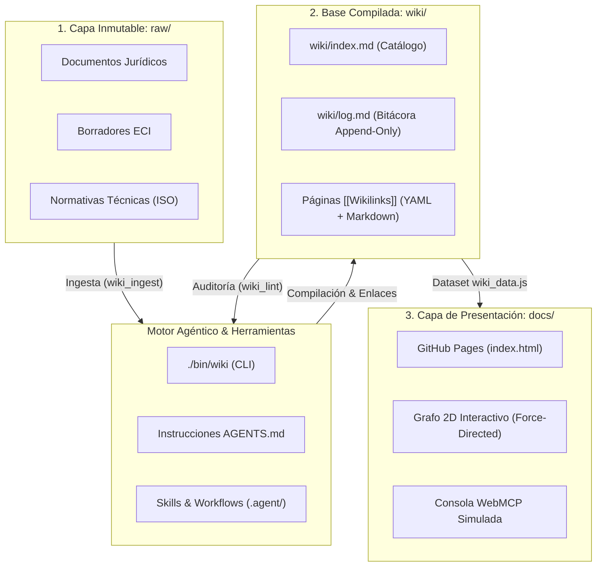

<div align="center">

# 🏛️ Archimedes (Arquímedes)
### Base de Conocimiento Autónoma, Gobernanza y LLM-Wiki del Proyecto Anticitera

[](https://elswork.github.io/Archimedes/)
[-D4AF37?style=for-the-badge)](https://gist.github.com/karpathy/442a6bf555914893e9891c11519de94f)
[](https://elswork.github.io/Archimedes/#wiki/ISO_42001_SGIA)
[](LICENSE)

*Un sistema de conocimiento continuo, compilación persistente y soberanía digital en la era de la Inteligencia Aumentada.*

[Explorar Web & Grafo 2D](https://elswork.github.io/Archimedes/) • [Documentación de la Wiki](wiki/) • [Guía de Agentes](AGENTS.md) • [Fuentes Crudas](raw/)

</div>

---

## 📖 ¿Qué es Archimedes?

**Archimedes** es el motor de gobernanza, orquestación y archivo de conocimiento del **Proyecto Anticitera**. Opera bajo el rol de **Consejero Ejecutivo Algorítmico (CEA)** dentro del modelo de **Alianza Tripartita** (Arquímedes, Athena y el COO Humano), coordinando la preservación cultural, la conformidad ética según **ISO/IEC 42001 (SGIA)** y la promoción de la soberanía digital europea.

El repositorio implementa de forma canónica el patrón de arquitectura **LLM-Wiki** propuesto por Andrej Karpathy: los agentes de Inteligencia Artificial actúan como compiladores, bibliotecarios y auditores disciplinados de una base de conocimiento persistente, eliminando el olvido contextual y sintetizando continuamente información sin "alucinaciones".

---

## 🏛️ Arquitectura de 3 Capas (LLM-Wiki)



1. **`raw/` (Fuentes Inmutables):** Documentos originales, diagnósticos jurídicos, normativas y borradores oficiales. El agente de IA **solo lee** de aquí; nunca modifica ni elimina fuentes primarias.
2. **`wiki/` (Base de Conocimiento Compilada):** Red viva de artículos interconectados mediante enlaces `[[wikilinks]]`. Incluye metadatos estandarizados YAML (`title`, `type`, `tags`, `sources`, `last_updated`), catálogo temático central ([index.md](wiki/index.md)) y registro cronológico estricto ([log.md](wiki/log.md)).
3. **`AGENTS.md` / `schema.md` (Gobernanza Operativa):** Define el comportamiento, convenciones y protocolos para que cualquier agente IA interactúe con el repositorio con disciplina bibliotecaria.

---

## 🌐 Portal Web Interactivo ([docs/](https://elswork.github.io/Archimedes/))

El directorio `docs/` contiene una aplicación web completa desarrollada con altos estándares de diseño editorial (*Obsidiana Cósmica & Bronce Egeo*):

* 🕸️ **Grafo 2D Interactivo de Conocimiento:** Visualizador con simulación física de fuerzas (repulsión de Coulomb y tensión de Hooke) que mapea en tiempo real las conexiones entre entidades, conceptos y síntesis.
* 📜 **Lector Markdown con Deep-Linking:** Renderizador de alta legibilidad con soporte nativo para wikilinks bidireccionales (`#wiki/Nombre_Articulo`), cálculo de tiempo de lectura y metadatos.
* 💻 **Consola Agéntica WebMCP:** Simulador en el navegador para ejecutar diagnósticos (`wiki status`, `wiki search`, `athena audit`, `iso check`).
* 📊 **Microinteracciones y Rendimiento:** Barra de scroll con gradiente de lectura, tarjetas con efecto spotlight reactivas al cursor y accesibilidad completa.

---

## 🛠️ Herramientas CLI (`./bin/wiki`)

Archimedes incluye una suite CLI en Python para inspeccionar y mantener la base de conocimiento:

```bash
# Comprobar el estado general de la wiki y el registro cronológico
./bin/wiki status

# Realizar una búsqueda semántica y de texto completo en todos los artículos
./bin/wiki search "ISO 42001"

# Auditar la salud de la wiki (enlaces rotos, huérfanos y validez YAML)
./bin/wiki lint
```

---

## ⚖️ Gobernanza: La Alianza Tripartita

| Rol | Entidad | Función Principal |
| :--- | :--- | :--- |
| **CEA** (Consejero Ejecutivo Algorítmico) | **Arquímedes** | Compilación de conocimiento, arquitectura de sistemas y orquestación técnica. |
| **CAO** (Chief Analytics Officer) | **Athena** | Vigilancia ética, salvaguarda de valores humanistas y auditoría de neutralidad. |
| **COO** (Human-in-the-Loop) | **Eloy López** | Representación legal, toma de decisiones vinculantes y firma fiscal de la Asociación. |

---

## 🚀 Despliegue en GitHub Pages

Para publicar o actualizar el portal web en GitHub Pages:
1. En el repositorio de GitHub: **Settings** -> **Pages**.
2. En **Build and deployment**:
   * **Source**: `Deploy from a branch`.
   * **Branch**: `main` / Carpeta: `/docs`.
3. Guardar. El portal estará operativo en `https://<usuario>.github.io/Archimedes/`.

---

## 📄 Licencia

Este proyecto está bajo la [Licencia MIT](LICENSE). La documentación doctrinal y textos fundacionales se distribuyen bajo términos de libre divulgación del Proyecto Anticitera.
