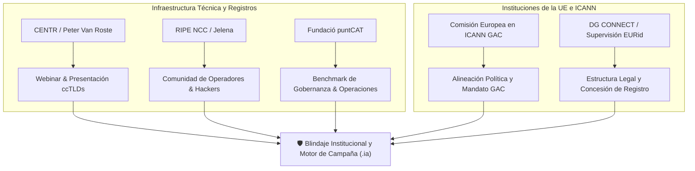

# 🏛️ Dossier Estratégico de Gobernanza Institucional e Infraestructura: CENTR, GAC, RIPE y .cat

**Proyecto Anticitera — Iniciativa Ciudadana Europea (.IA)**  
**Fecha:** 25 de Agosto de 2026  
**Coordinador:** Eloy López Sánchez  
**Asesora de Estrategia:** Amelia Andersdotter (Ex-Eurodiputada, Defensora de Derechos Digitales)  

---

## 🎯 Resumen Ejecutivo

A raíz del análisis estratégico aportado por Amelia Andersdotter, el Proyecto Anticitera activa una hoja de ruta diplomática, institucional y técnica estructurada en **cinco vías de acción paralelas**.

El objetivo es aprovechar la **ventana de examen formal de 60 días en la Comisión Europea** (Reglamento UE 2019/788) para construir alianzas con la infraestructura técnica y los reguladores de Internet *antes* de que comience la cuenta atrás de 12 meses para la recogida del 1.000.000 de firmas.

---

## 🌐 VÍA 1: Alianza con Registros Europeos — CENTR (*Council of European National Top-Level Domain Registries*)

### 1. Perfil del Contacto Clave
* **Nombre:** Peter Van Roste (`peter@centr.org`)
* **Cargo:** General Manager de CENTR.
* **Contexto:** CENTR agrupa a los administradores de ccTLDs de Europa (como `.de`, `.fr`, `.es`, `.se`, `.eu`, `.cat`).
* **Vía de Entrada:** Referencia directa de Amelia Andersdotter (*"you can say hi from me"*).

### 2. Argumentario Estratégico (*Business & Sovereignty*)
Para evitar que los ccTLDs perciban a `.ia` como una amenaza competitiva, el discurso ante CENTR debe fundamentarse en:
1. **Soberanía Financiera:** En la actualidad, el auge de la IA genera millones de euros en dominios `.ai` cuyos ingresos van a parar a Anguila y a intermediarios privados extranjeros. Un TLD `.ia` público garantiza que el capital y la recaudación fiscal permanezcan en entidades bancarias europeas.
2. **Complementariedad Lingüística y Regional:** En las lenguas romances del sur y oeste de Europa (español, francés, italiano, portugués, rumano), el acrónimo natural es **IA** (*Inteligencia Artificial*). No compite con el ccTLD territorial, sino que ofrece una alternativa soberana frente a los gTLDs comerciales norteamericanos.
3. **Precedentes de Registros Comunitarios y Públicos en CENTR:** Tanto `.eu` (EURid) como `.cat` (Fundació puntCAT) son miembros activos de CENTR, demostrando que CENTR es el hogar natural para dominios de interés público y gobernanza compartida.

### 3. Plan de Acción Inmediato
* [x] Redactar borrador de correo formal para Peter Van Roste ([`drafts/Borrador_Contacto_CENTR_Peter_Van_Roste.md`](file:///home/pirate/docker/Arquimedes/drafts/Borrador_Contacto_CENTR_Peter_Van_Roste.md)).
* [ ] Enviar correo solicitando una breve videollamada de 15 minutos o una plaza de presentación en sus grupos de trabajo.
* [ ] Proponer la organización de un webinar técnico y económico conjunto sobre soberanía en el DNS europeo.

---

## ⚡ VÍA 2: Comunidad Técnica de Redes — RIPE NCC

### 1. Objetivo y Contacto
* **Interlocutora sugerida por Amelia:** Jelena (RIPE NCC / Relaciones Comunitarias e Institucionales).
* **Entidad:** RIPE NCC (*Réseaux IP Européens Network Coordination Centre*), el Registro Regional de Internet (RIR) para Europa y Oriente Medio.

### 2. Enfoque Táctico
* **Legitimidad de Base:** RIPE agrupa a los ingenieros de red, ISPs, centros de datos y operadores que construyen el tejido físico de Internet en Europa.
* **Presentación en RIPE Meetings / Webinars:** Presentar la arquitectura criptográfica y de identidad descentralizada del Distrito Digital `.ia` ante los operadores técnicos para sumar apoyos de infraestructura y difusión.

---

## 🏛️ VÍA 3: Vía Regulatoria Global — El GAC de ICANN (*Governmental Advisory Committee*)

### 1. La Función del GAC
El *Governmental Advisory Committee* (GAC) de ICANN es el órgano a través del cual los gobiernos nacionales y la Comisión Europea emiten directrices de política pública a la junta directiva de ICANN.

### 2. Mapeo del Representante de la Comisión Europea
* **Representación Institucional:** La Comisión Europea cuenta con un representante oficial y suplentes en el GAC, designados habitualmente desde la **DG CONNECT** (Dirección General de Redes de Comunicación, Contenido y Tecnologías).
* **Unidad Clave:** DG CONNECT — *Internet Governance and Policy / Future Networks*.
* **Objetivo de la Reunión:**
  - Presentar la ICE `.ia` registrada en Bruselas.
  - Anticipar la posición del GAC para que la Comisión Europea, una vez respaldada la ICE por el millón de firmas, instruya formalmente a su representante en el GAC para defender la delegación pública del TLD `.ia` sin someterse a subastas especulativas de gTLDs.

---

## 🇪🇺 VÍA 4: Supervisión de Registros Europeos — DG CONNECT y EURid

### 1. Lecciones de Gobernanza de EURid (`.eu`)
Amelia Andersdotter señala con acierto que el control público de la Comisión sobre EURid ha revelado rigideces operativas.
* **Aprendizaje Clave:** No diseñar la entidad gestora de `.ia` como un apéndice burocrático rígido, sino como un consorcio ágil de interés público (gobernanza multi-stakeholder: hackers, academia, sociedad civil y PYMEs de IA).

### 2. Interlocutores en la Comisión
* **Supervisión de EURid:** La unidad de DG CONNECT encargada de la contratación y supervisión del contrato de concesión del dominio `.eu`.
* **Propósito:** Abrir canal de diálogo informal para entender qué requisitos contractuales y de auditoría exige la Comisión en la gestión de registros delegados.

---

## 🐱 VÍA 5: Trabajo de Campo Local — Benchmark con la Fundació puntCAT (`.cat`)

### 1. Por qué `.cat` es el Modelo de Referencia
El dominio `.cat` (creado en 2005) fue el **primer dominio de primer nivel del mundo concedido a una comunidad lingüística y cultural**, superando el marco rígido de los ccTLDs de estados soberanos.

### 2. Puntos Clave para el Estudio de Campo en España
* **Gobernanza:** Cómo la *Fundació puntCAT* estructuró un patronato independiente de la sociedad civil, empresas y universidades para no depender del control partidista de ningún gobierno.
* **Operativa y Personal:** Cómo dimensionaron su plantilla técnica y administrativa, y cómo subcontrataron el backend técnico (con operadores de registro como CORE) para mantener una estructura ligera y financieramente sostenible.
* **Modelo Económico:** Cómo reinvierten los excedentes de los registros en proyectos de software libre, digitalización comunitaria y derechos digitales.

---

## ⏳ VÍA 6: Plan de Mitigación del Embudo de Firmas (1M de Firmas)

Amelia advirtió del peligro del *funnel*:
$$\text{Comparten la visión} \longrightarrow \text{La difunden a amigos} \longrightarrow \text{Firman la ICE en el portal oficial}$$

### Estrategia de Choque durante los 60 días de Examen Formal:
1. **Pre-campaña de Embajadores:** No esperar a que empiece el reloj; cerrar acuerdos de adhesión previa con comunidades de software libre, colegios profesionales, universidades y colectivos de hackers.
2. **Simplicidad de Firma (eIDAS y Firma Digital):** Preparar guías claras para que la ciudadanía pueda firmar en segundos utilizando los sistemas de identidad electrónica europeos (DNIe, Cl@ve, BankID, FranceConnect, SPID, etc.).
3. **Alianzas con Medios Especializados:** Diseñar el kit de prensa y los artículos de opinión para medios de tecnología europeos desde el primer día de la campaña oficial.
