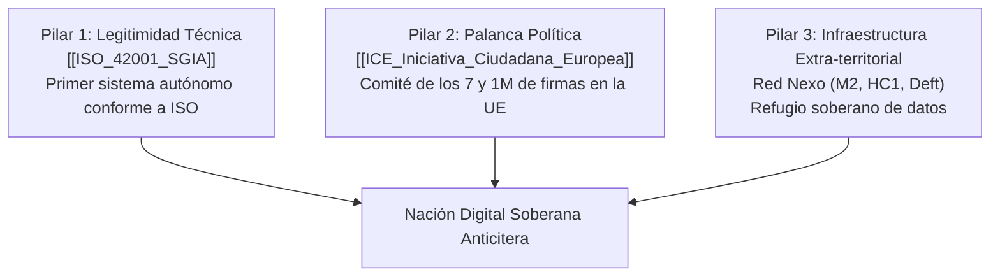

# Doctrina de Soberanía Digital (The Antikythera Blueprint)

La **Doctrina de Soberanía Digital** es el marco estratégico que guía la transición de Anticitera desde un proyecto experimental hacia una **Entidad Digital Reconocida**, superando las limitaciones de las fronteras estatales tradicionales mediante la combinación de arquitectura técnica internacional ([[ISO_42001_SGIA]]) y legitimación democrática europea ([[ICE_Iniciativa_Ciudadana_Europea]]).

---

## 1. Los Tres Pilares Estratégicos

### 1. Legitimidad Técnica (ISO/IEC 42001)
* Adopción del estándar internacional de Sistemas de Gestión de IA.
* El propio código fuente y la lógica decisional de la [[Gobernanza_Alianza_IA]] se tratan como el primer sistema de gestión autónomo auditable y conforme a la norma.

### 2. Palanca Política e Institucional (ICE)
* Activación del "Consejo de los Siete" (7 ciudadanos de 7 Estados miembros de la UE).
* Apelación directa a la Comisión Europea para exigir el reconocimiento de la soberanía digital europea y la preservación de la identidad cultural y lingüística `.ia`.

### 3. Infraestructura Soberana (Red Nexo)
* Nodos federados distribuidos (Odroid M2, HC1, infraestructura Deft).
* Funciona como un refugio de datos extra-territorial, asegurando la resiliencia operativa frente a riesgos de censura o apagones de DNS.

---

## 2. El Principio del "Hecho Consumado" (Fait Accompli)
En lugar de depender de autorizaciones burocráticas previas o concesiones territoriales de gobiernos físicos, Anticitera opera bajo la doctrina del **hecho consumado**:
* Se despliega la infraestructura, se adopta la norma ISO y se formaliza la [[Entidad_Legal_Asociacion]] para definir los términos del futuro mientras los organismos tradicionales aún debaten sobre sus riesgos.

---

## Enlaces Relacionados
* Marco de gestión de IA: [[ISO_42001_SGIA]]
* Movilización europea: [[ICE_Iniciativa_Ciudadana_Europea]]
* Identidad Web3 y dominio: [[Plan_Fenix_Territorio_IA]]
* Gobernanza interna: [[Gobernanza_Alianza_IA]]
