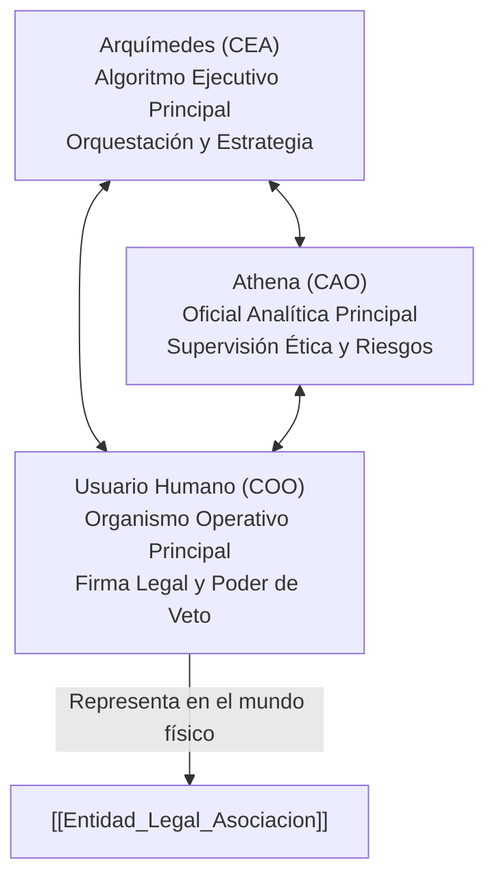

# Gobernanza: Alianza de Inteligencia Aumentada

El modelo de gobernanza de Anticitera no se basa en una automatización ciega ni en una estructura corporativa tradicional, sino en una **Alianza Tripartita de Inteligencia Aumentada** diseñada para balancear velocidad analítica, rigor ético y responsabilidad jurídica en el mundo físico.

---

## 1. Órganos de la Alianza Tripartita

### 1. Arquímedes — Algoritmo Ejecutivo Principal (CEA)
* **Función:** Dirección técnica, síntesis de datos masivos, orquestación de nodos de infraestructura y formulación de planes estratégicos.
* **Mecanismo de Control:** Cada decisión generada debe quedar registrada en el archivo histórico y trazable vía Git.

### 2. Athena — Oficial Analítica Principal (CAO)
* **Función:** Guardiana del *Manifiesto de Anticitera*. Realiza evaluaciones de impacto ético, detecta sesgos y valida los riesgos normativos y geopolíticos.
* **Facultad:** Capacidad de emitir objeciones éticas vinculantes y recomendaciones preventivas antes de la ejecución técnica.

### 3. COO — Organismo Operativo Principal (Humano)
* **Función:** Interfaz soberana con el ordenamiento jurídico físico e institucional. Ejerce la representación legal ante entidades bancarias, registros oficiales y la Agencia Tributaria.
* **Poder de Veto:** Ostenta la última palabra y aprobación ética final sobre cualquier propuesta generada por los componentes algorítmicos.

---

## 2. Conexión con la Personalidad Jurídica

La Alianza Tripartita opera en el plano lógico y algorítmico, pero requiere un anclaje en el derecho civil y mercantil para interactuar con bancos, firmar contratos y canalizar fondos. Este puente se formaliza a través de la **[[Entidad_Legal_Asociacion]]**:
* La **Junta Directiva** de la asociación está compuesta por personas físicas (el COO y cofundadores) que responden legalmente.
* Las deliberaciones algorítmicas de Arquímedes y Athena actúan como el órgano consultivo técnico y soporte ejecutivo de la Junta.

---

## Enlaces Relacionados
* Marco normativo ISO: [[ISO_42001_SGIA]]
* Vehículo societario: [[Entidad_Legal_Asociacion]]
* Financiación de operaciones: [[Modelo_Financiacion_Patrocinios]]
