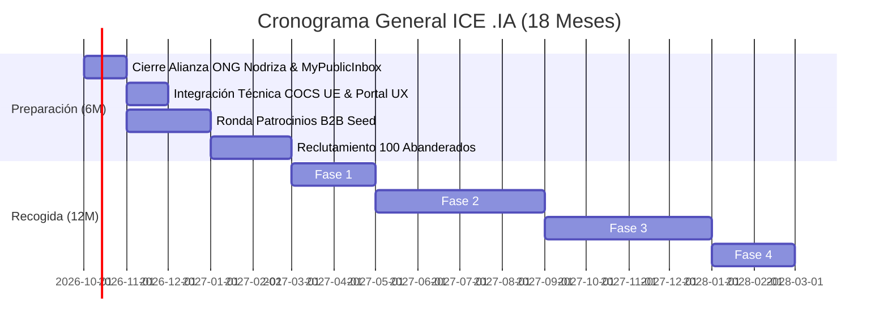
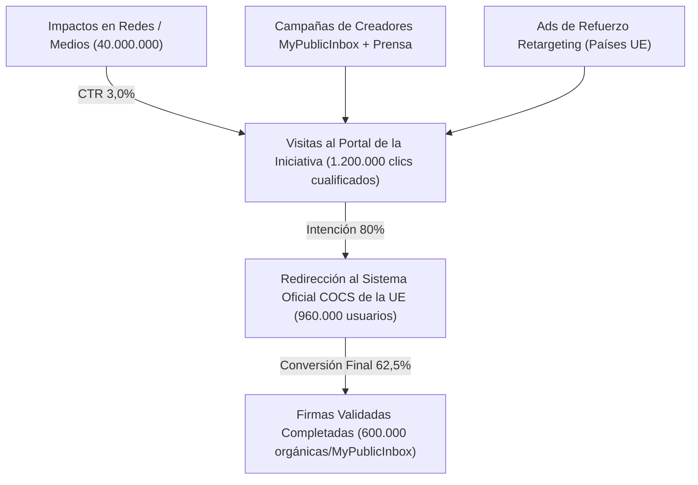
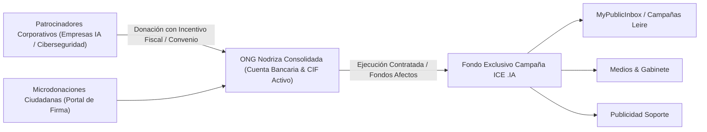

# Plan Cuantificado de Campaña y Financiación: 1M Firmas ICE .IA

Plan estratégico y modelo económico cuantificado para la recogida de **1.200.000 declaraciones de apoyo** para la [[ICE_Iniciativa_Ciudadana_Europea]] del dominio soberano `.ia`. 

Este plan responde directamente al requerimiento ejecutivo de **Chema Alonso** (*"bajar a números lo que estás pensando para validarlo"*) y articula la integración operativa con **MyPublicInbox** y el modelo de **ONG Nodriza existente**.

---

## 1. El Marco Legal y los Objetivos Cuantitativos

De acuerdo con el **Reglamento (UE) 2019/788** sobre la Iniciativa Ciudadana Europea:
* **Umbral Mínimo Legal:** 1.000.000 de firmas validadas.
* **Margen de Seguridad (Buffer +20%):** **1.200.000 firmas brutas** objetivo para amortiguar firmas anuladas por discrepancias de censo, errores de DNI o duplicados.
* **Criterio Geográfico:** Superar el umbral mínimo de firmas en al menos **7 Estados miembros** de la UE.

### Distribución Territorial de Firmas por Países Clave

Nos apoyamos en la afinidad natural del acrónimo lingüístico **IA** (*Inteligencia Artificial / Intelligence Artificielle / Intelligenza Artificiale*) en el espacio romance y la soberanía tecnológica europea:

| País | Umbral Mínimo Legal UE | Objetivo de Campaña Anticitera | Justificación Estratégica |
| :--- | :--- | :--- | :--- |
| **España** 🇪🇸 | 41.595 | **450.000** | Núcleo impulsor; red MyPublicInbox, Chema Alonso, medios tech nacionales y tejido hacker. |
| **Francia** 🇫🇷 | 55.695 | **250.000** | Defensa de la excepción cultural y lingüística (*IA* vs. *AI*); ecosistema IA de París (Mistral, INRIA). |
| **Italia** 🇮🇹 | 53.580 | **180.000** | Afinidad total con el término *IA*; fuerte movimiento por la soberanía de datos y PYMEs industriales. |
| **Portugal** 🇵🇹 | 14.805 | **75.000** | Espacio lusófono; puente institucional y Web Summit / comunidad tecnológica de Lisboa. |
| **Alemania** 🇩🇪 | 67.680 | **100.000** | Capital de soberanía de datos europea; apoyo de la comunidad de software libre (Chaos Computer Club, FSFE). |
| **Bélgica** 🇧🇪 | 14.805 | **50.000** | Epicentro institucional de Bruselas; comunidad francófona y flamenca conectada con DG CONNECT. |
| **Rumanía** 🇷🇴 | 23.265 | **45.000** | Lengua romance (*Inteligență Artificială*); gran comunidad de ingenieros y desarrolladores de software. |
| **Otros 20 países UE** | — | **50.000** | Goteo orgánico transnacional de la diáspora digital y entusiastas de la descentralización. |
| **TOTAL** | **> 267.860** | **1.200.000** | **Objetivo global cubierto con holgura en 7+ países.** |

---

## 2. Cronograma de Ejecución: 6 Meses de Preparación + 12 Meses de Recogida

### Ventana de Preparación (Meses 1-6: Octubre 2026 – Marzo 2027)
1. **Mes 1 (Octubre 2026):** Acuerdo marco con la **ONG Nodriza** sugerida por Chema Alonso y definición del plan operativo de creadores con **Leire (MyPublicInbox)**.
2. **Mes 2 (Noviembre 2026):** Configuración del **Sistema Central de Recogida en Línea (COCS)** de la Comisión Europea con soporte de firma electrónica (DNIe / eIDAS / Cl@ve / FranceConnect).
3. **Meses 3-4 (Diciembre 2026 – Enero 2027):** Captación del fondo de campaña mediante 10-12 patrocinios de empresas de IA ética y soberanía tecnológica (150.000 € – 200.000 €).
4. **Mes 5 (Febrero 2027):** Activación y briefing del batallón de **100 Abanderados Digitales** a través de MyPublicInbox.
5. **Mes 6 (Marzo 2027):** Notificación formal a la Comisión Europea fijando la fecha oficial de inicio de la recogida.

### Ventana de Recogida Oficial (Meses 7-18: 12 meses continuos)
* **Fase A (Meses 7-8 / "El Big Bang"):** Objetivo: **300.000 firmas**. Gran rueda de prensa y vídeo de lanzamiento con Chema Alonso y los principales abanderados. Viralización en redes profesionales y medios tech.
* **Fase B (Meses 9-12 / "El Tejido Asociativo y Universitario"):** Objetivo: **400.000 firmas** (acumulado 700.000). Gira universitaria, hackathons, colegios oficiales de informática y telecomunicaciones, y webinars técnicos con la comunidad de ccTLDs y [[Doctrina_Soberania_Digital]].
* **Fase C (Meses 13-15 / "Tracción Transnacional"):** Objetivo: **250.000 firmas** (acumulado 950.000). Activación de redes homólogas en Francia, Italia y Portugal mediante creadores locales.
* **Fase D (Meses 16-18 / "El Sprint Final de 90 Días"):** Objetivo: **250.000 firmas** (acumulado 1.200.000). Campaña de urgencia nacional y europea (*"Última llamada para blindar la IA europea"*).

---

## 3. El Embudo de Conversión (Funnel de Firmas)

Firmar una ICE exige identificación fehaciente (nombre completo, fecha de nacimiento y documento de identidad o certificado eIDAS):

### Métricas de Rendimiento:
* **Tasa de conversión de visita a firma en tráfico cualificado (con recomendación de abanderado):** **10% – 12%**.
* **Tráfico necesario total en 12 meses:** ~10.000.000 a 12.000.000 de impresiones directas en landing page.
* **Coste de Adquisición por Firma (CAC):**
  * Modelo de agencia publicitaria fría tradicional: 1,50 € – 2,50 € por firma (inviable: requeriría 2M €).
  * **Modelo Anticitera + MyPublicInbox + Red Hacker:** **~0,17 € por firma** (gracias al factor multiplicador orgánico de los abanderados).

---

## 4. Presupuesto Económico Detallado ("Bajar a Números")

Estructura presupuestaria austera y eficiente para los 18 meses de operación:

| Partida | Concepto / Detalle | Coste Estimado | Porcentaje |
| :--- | :--- | :--- | :--- |
| **1. Red MyPublicInbox y Creadores** | Compensación / incentivos de campaña para creadores de contenido, microcampañas gestionadas con Leire, soporte de difusión. | **75.000 €** | 37,5% |
| **2. Marketing Digital y Ads de Apoyo** | Publicidad programática segmentada y retargeting en LinkedIn/Meta/X en Francia, Italia, Alemania y Portugal para asegurar los umbrales mínimos. | **45.000 €** | 22,5% |
| **3. Gabinete de Comunicación y Prensa** | Ruedas de prensa, notas para medios nacionales e internacionales, vídeo de campaña profesional, kit de prensa. | **30.000 €** | 15,0% |
| **4. Plataforma Web Satélite y UX** | Landing multilingüe (ES, FR, IT, PT, EN, DE), CDN, analítica sin cookies privacy-friendly, integración visual con validador de la UE. | **15.000 €** | 7,5% |
| **5. Secretaría Técnica y Auditoría ONG** | Coordinación jurídica de la ICE, gestoría contable, auditoría externa obligatoria por el Reglamento ICE de la UE. | **20.000 €** | 10,0% |
| **6. Fondo de Contingencia Operativa** | Reserva imprevistos para eventos presenciales o refuerzo de sprint final. | **15.000 €** | 7,5% |
| **TOTAL PRESUPUESTO OPERATIVO** | **Despliegue integral de los 18 meses** | **200.000 €** | **100%** |

$$\text{CAC Promedio} = \frac{200.000 \text{ €}}{1.200.000 \text{ firmas}} = \mathbf{0,167 \text{ € por firma}}$$

---

## 5. Modelo de Financiación: El Valor de la "ONG Nodriza"

La recomendación de Chema Alonso de **apoyarse en una ONG existente** en lugar de constituir una nueva asociación transforma radicalmente la viabilidad económica:

### Ventajas Operativas de la ONG Existente vs. Nueva Asociación:
1. **Tiempo Cero de Espera:** Disponibilidad inmediata de NIF, cuenta corriente bancaria corporativa y pasarela de pago activa (frente a 2-3 meses de registro para una entidad nueva).
2. **Confianza Ciudadana Inmediata:** Pedir el DNI para la Comisión Europea a través de una marca de la sociedad civil respetada elimina el recelo del usuario.
3. **Incentivos Fiscales de Mecenazgo:** Si la ONG está acogida a la Ley 49/2002 de Mecenazgo, las empresas patrocinadoras pueden **deducir hasta el 40-50%** de su donación en el Impuesto sobre Sociedades.
4. **Estructura de Captación:**
   * **10 Patrocinadores Principales (Tier Gold):** 15.000 € c/u = 150.000 €.
   * **10 Patrocinadores Secundarios (Tier Silver):** 5.000 € c/u = 50.000 €.
   * **Fondo asegurado:** **200.000 €**.

---

## 6. Próximos Pasos Inmediatos

1. **Contacto con Leire (MyPublicInbox):** Agendar sesión de trabajo para perfilar los paquetes de perfiles, mecánicas de campaña y herramientas de seguimiento de firmas.
2. **Validación con Chema Alonso:** Enviar este dossier ejecutivo para recibir su feedback crítico, sugerencia de la ONG idónea y luz verde institucional.
3. **Formalización del Comité de Ciudadanos:** Acreditar a los 7 miembros mínimos de la UE requeridos por el portal de la Comisión Europea.

---

## Enlaces Relacionados
* Marco de la iniciativa europea: [[ICE_Iniciativa_Ciudadana_Europea]]
* Marco de gobernanza: [[Gobernanza_Alianza_IA]]
* Doctrina de soberanía institucional: [[Doctrina_Soberania_Digital]]
* Hoja de ruta estratégica territorial: [[Plan_Fenix_Territorio_IA]]
