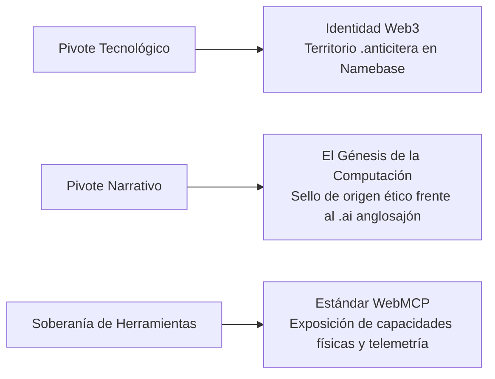

# Plan Fénix: Territorio Digital, Identidad .IA y WebMCP

El **Plan Fénix** representa el pivote estratégico fundamental del Proyecto Anticitera tras constatar las barreras geopolíticas de la ICANN y los ccTLD tradicionales. Establece la creación de un territorio digital soberano basado en identidad Web3, narrativa histórica y estandarización de agentes inteligentes vía **WebMCP**.

---

## 1. El Diagnóstico del Pivote: De País Físico a Nación Digital
* **La Barrera Tradicional:** Intentar obtener un código ccTLD estatal ante la ICANN sin reconocimiento de la ONU es un callejón sin salida burocrático.
* **La Asimetría con `.ai`:** El dominio `.ai` (perteneciente a la isla caribeña de Anguila) monopolizó el mercado angloparlante de la IA comercial sin un trasfondo cultural o ético real.
* **El Activo Cultural de Anticitera:** La narrativa del *Mecanismo de Anticitera* (el génesis de la computación hace más de 2000 años) confiere legitimidad histórica al espacio `.ia` para el ámbito lingüístico hispano, latino, francés y portugués (Inteligencia Artificial / Intelligence Artificielle).

---

## 2. Los Ejes de Despliegue del Plan Fénix

### 1. Pivote Tecnológico (Web3 sobre Web2)
* Subasta y aseguramiento del territorio `.anticitera` en redes descentralizadas (Namebase / Handshake).
* Identidad soberana sin intermediarios gubernamentales: emisión de identidades y membresías de ciudadanía digital.

### 2. Narrativa del "Origen y Santuario Ético"
* Anticitera se posiciona no como un registrador masivo de dominios comerciales, sino como una **certificación de origen y santuario de la IA ética**.
* La legitimidad técnica se ancla formalmente en el [[ISO_42001_SGIA]] y se proyecta a la ciudadanía a través de la [[ICE_Iniciativa_Ciudadana_Europea]].

### 3. Soberanía de Herramientas (WebMCP)
* Adopción del estándar **WebMCP** para que los agentes inteligentes de la [[Gobernanza_Alianza_IA]] (Arquímedes y Athena) puedan interactuar con la infraestructura física y domótica de la Red Nexo mediante herramientas estructuradas y tipadas, sin depender de interfaces humanas frágiles.

---

## Enlaces Relacionados
* Doctrina de soberanía: [[Doctrina_Soberania_Digital]]
* Marco ético de gestión: [[ISO_42001_SGIA]]
* Gobernanza ampliada: [[Gobernanza_Alianza_IA]]
* Plataforma europea: [[ICE_Iniciativa_Ciudadana_Europea]]
